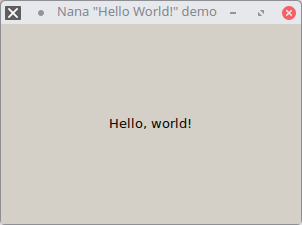

# Nana "Hello World!" demo

## Description

This program displays the classic _"Hello, world!"_ string using [Nana C++ GUI library](http://nanapro.org/en-us/).

+ **Language:** C++11/14.
+ **Compiler:** Any Standard C++ compiler(Visual C++ 2013, GCC/MinGW and Clang).
+ **OS:** GNU/Linux, Microsoft Windows and Mac OS (experimental).

## License

[ISC License](https://opensource.org/licenses/ISC).

More information about this license: [https://choosealicense.com/licenses/isc/](https://choosealicense.com/licenses/isc/).
